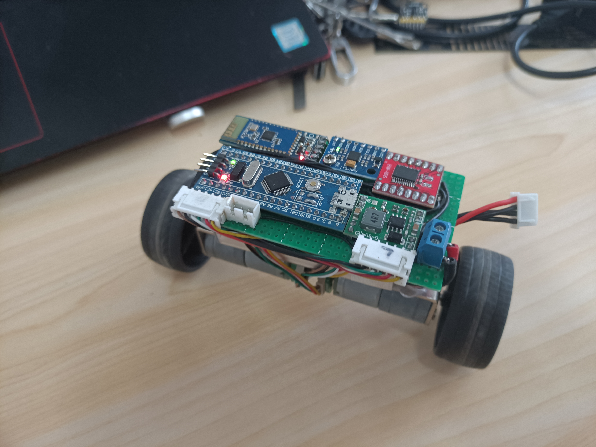
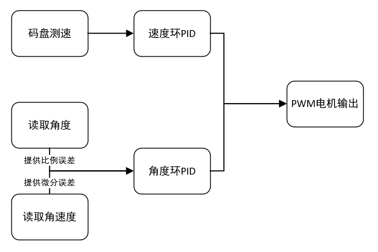
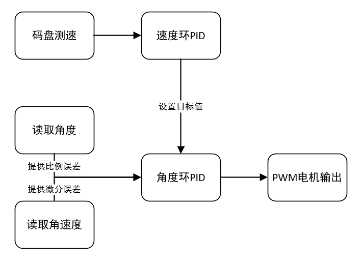

# 简单的平衡小车实现  
程序结构并未参考其他任何实现(反正也不难)。  
代码请使用[Release版本](https://github.com/h13-0/BalanceCar/releases)  

## PID实现
### 方法一: 并级PID  
  
优点:  
PID结构较为简单。  
缺点:
对机械中值精度要求较高, 对陀螺仪初始垂线(即pitch角0度线)精度要求较高。  
无法承担偏心负载。  

### 方法二: 串级PID  
  
优点:  
可以承受偏心负载, 对陀螺仪初始垂线要求低。
